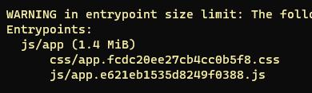
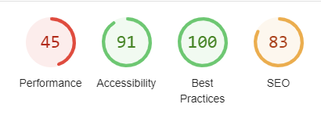

I have a sidetrack backlog on my current client where I look over the web performance of the website. It's a major e-commerce website that sells the products in Europe, US and Russia. When I started working with the client nearly a year ago, there wasn't much talk about web perf at all. However, things were in dire straits - we had a combined bundle of 1.4 mega bytes - way over the ~250 kB that Webpack recommends. Upon this, the site is also heavy on large images (not included in the asset size below).

My main focus has always been the "normal" backlog, so I've tried to squeeze in web perf work whenever I had time. I've probably spent at least 4-8 hours a week for the past 6 months, and a lot of that time has mostly been spent on research and testing things.

Today we're sitting at a combined bundle of less than 500 kB. I regret to say that I don't have any Lighthouse metrics from the start, but today they're roughly at around 50.

I'm not even close to being finished (if you even ever get to reach the finish line). However, I've really learnt a lot about web perf and there are many things that I thought would satisfy Lighthouse, but in the end didn't.

If you're about to dive into web perf and core web vitals, let me first share some key learnings.

### Before you begin

*Set up web perf tracking and get your team engaged and onboard!*

**As I mentioned**, I regret that I don't have any metrics for the website before I started. Some services that provide this kind of metric tracking is [treo.sh](https://treo.sh/) and [speedcurve.com](https://www.speedcurve.com/). If you can't convince management to pay for such a service, you can set up [Speedlify](https://github.com/zachleat/speedlify/) on Netlify for free.

If you can, try to measure what web perf means for your organization in terms of money. This will make it easier for you to argue that the subscription cost is worth it.

**Also**, I hope you have nice colleagues that share your interest in web perf. I made the mistake in not involving my colleagues enough, and now that I've done so much - I don't have their attention. I also didn't involve the online team enough, so even they are not really aware of the gains I already achieved.

**These learnings are crucial if you want to be successful!**

As a last learning for this part - Core web vitals is the ultimate grind. It's not about getting rid of jQuery. Not even close. It's so much more - code splitting, replacing obsolete code and battling management in order to reduce third party scripts and change their beloved font.

Be ready!
