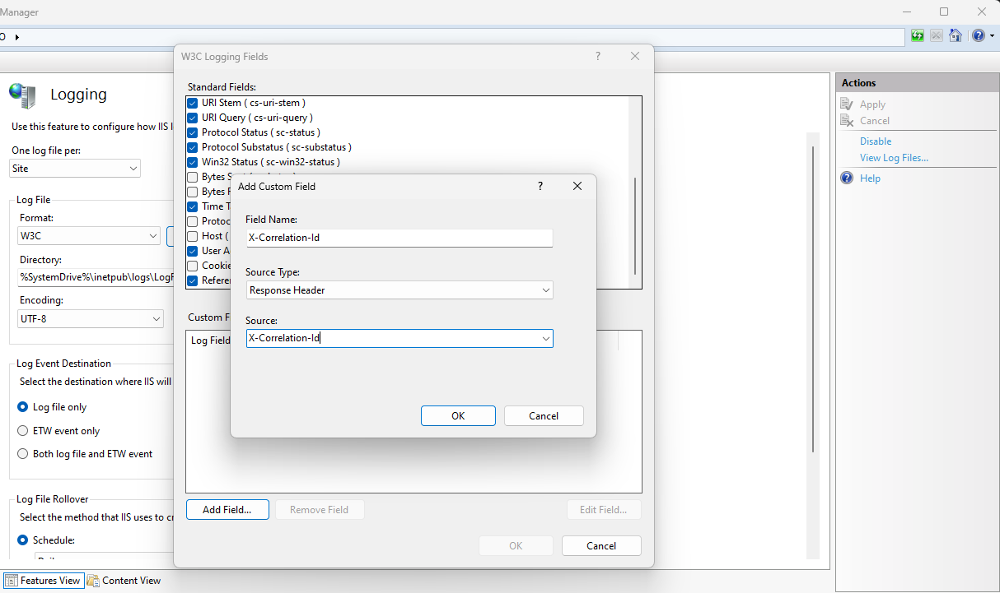

A [correlation ID](https://www.enterpriseintegrationpatterns.com/patterns/messaging/CorrelationIdentifier.html) (or request ID) is a token that uniquely identifies a HTTP request. In application logs, we can use it to figure out what events occured within the scope of a request. However, other than application logs - we also have web server request logs, and it would be meaningful to correlate the web server log with the application log. This post will provide a solution for this scenario.

The setup in this particular scenario will be IIS, hosting a ASP MVC application. This application will make use of [Serilog](https://serilog.net/) since it's a common logging library and provides helpful functionality to achieve the goal.

So, in order to have Serilog set up - make sure to have the following Nuget packages installed:

[Serilog](https://www.nuget.org/packages/Serilog/)

[SerilogWeb.Classic](https://www.nuget.org/packages/SerilogWeb.Classic)

The latter nuget package will provide methods to enrich your logs with certain HTTP request data - like URL, method and correlation ID. The example below highlights the enricher for correlation ID.

```csharp
var logger = new LoggerConfiguration()
    .Enrich.WithHttpSessionId()
    .Enrich.WithHttpRequestId() // correlation ID
    .Enrich.WithHttpRequestUrl()
    .Enrich.WithHttpRequestNumber()
    .WriteTo.Console()
    .CreateLogger();
```

Now we've made sure that Serilog includes an ID with every log event.

Internally, Serilog uses a helper method called `HttpRequestIdEnricher.TryGetCurrentHttpRequestId(out Guid requestId)` which creates and caches an ID, which can be reused throughout the request lifetime. We can use this method to make the same ID available for IIS request log.

Since this post describes a ASP MVC setup, the following code can be added to `Global.asax.cs`.

```csharp
protected void Application_EndRequest(object sender, EventArgs e)
{
    if (sender is HttpApplication application)
    {
        var httpResponse = application.Context.Response;

        if (httpResponse.HeadersWritten)
        {
            return;
        }

        // Fetch correlation ID used by Serilog and add onto response header, so that IIS can include it in IIS request log
        if (httpResponse.Headers["X-Correlation-Id"] == null && HttpRequestIdEnricher.TryGetCurrentHttpRequestId(out var correlationId))
        {
            httpResponse.Headers.Add("X-Correlation-Id", correlationId.ToString());
        }
    }
}
```

The code makes use of `TryGetCurrentHttpRequestId` to fetch the cached ID and adds it to the response headers named `X-Correlation-ID`.

This allows us to add the response header to our IIS logs, as shown below:



Don't forget to apply the changes in IIS (= save the changes).

Now both the IIS request logs and the application logs will share the same correlation ID so that you can match them.

This is the end of this post. But, the logical next step to really make value of your logs is to send them to Kibana for parsing and visualization.
