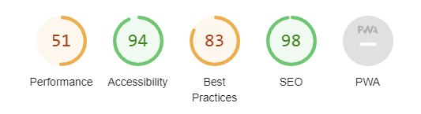
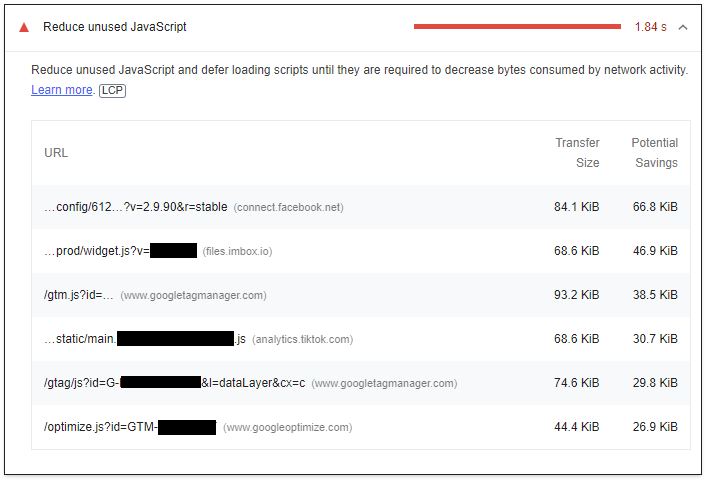
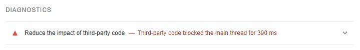
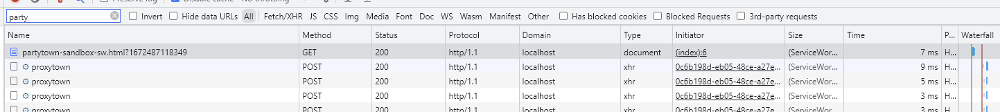
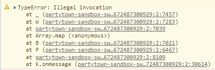
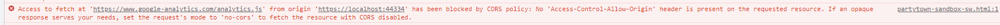
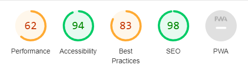

This will be a post that's updated as I learn to implement [Partytown](https://partytown.builder.io/), which honestly doesn't seem straightforward - at all.

## Prelude

I've been [deep diving into web performance](https://andreas.jilvero.se/blog/a-guide-to-improve-your-core-web-vitals/) during the last year and tried to implement my findings on my current customer, with good results. The last (?) major issue is third party scripts. The comprehensive list are as follows.

Google Tag Manager

Google Optimize

Facebook/Meta Pixel

TikTok Pixel

Pinterest

Hotjar

These scripts are currently the largest performance villain on the web application. To improve performance, the only options are to either remove the scripts - which will not happen - or to try Partytown.

My understanding of Partytown is that it somehow runs third party scripts separate from the main thread, and that this method should offload the web application in a way that performance metrics are (greatly) improved.

I will therefore try to implement Partytown on the web application of my current customer. It so happens that this web app does not use any frontend framework like React, Vue or Solid. It's a .NET Core 6 web application with HTML, JS and CSS - no fuzz. It's thus clear that I should follow the [HTML guide](https://partytown.builder.io/html). I use Webpack as a bundler.

These are the metrics before using Partytown.










## Part 1 - The snippet

Once you've installed the NPM library, it seems we should inline configuration and a snippet in the `<head>` section. Partytown has a [Webpack utility script](https://partytown.builder.io/copy-library-files#webpack) that's used to include the Partytown files in your build folder, and thus also include references to the files in the manifest file - if you have one.

I created a file for the Partytown configuration `partytownConfig.js`.

```javascript
window.partytown = {
  lib: `${__PUBLIC_PATH__}js/~partytown/`,
  forward: ['ttq.track', 'ttq.page', 'ttq.load', 'dataLayer.push', 'fbq']
}
```

`__PUBLIC_PATH__` is set to my build folder path in [DefinePlugin](https://webpack.js.org/plugins/define-plugin/).

I include `partytownConfig.js` in Webpack as its own entry point.

```javascript
'partytownConfig': {
  import: './js/app/partytownConfig.js',
  runtime: false
},
```

`runtime: false` sets this entry point to not depend on the Webpack runtime. This is handy if you want to inline a script directly in your DOM (where you might not yet have a Webpack context).

The following is added to the `<head>` tag - probably as high as possible. `@WebAssets.GetContent("...")` is a function that (1) reads the manifest and (2) fetches the content of a file.

```html
<script>
    @Html.Raw(WebAssets.GetContent("js/partytownConfig.js"))
</script>
<script>
    @Html.Raw(WebAssets.GetContent("js/partytown.js"))
</script>
```

In essence, these are the steps [the docs](https://partytown.builder.io/html) mention - so let's try it! I'm wrapping all 3rd party initialization scripts in `text/partytown` script types. These scripts are generally just a short stub that lazy loads larger scripts.

### Results

Regarding Partytown, the following is loaded according to Devtools Network tab.




There are in total 313 requests to proxytown.

I also get this warning, but I have no clue what it's about.



However, looking at the 3rd party scripts, only a few scripts successfully loads.

Google Tag Manager ✅

Google Analytics ❌

Imbox ❌ (script seems incompatible with Partytown)

Google Optimize ✅

Facebook Pixel ❌

TikTok Pixel ❌

Pinterest ❌

Hotjar ❌

The common issue (except Imbox) for the failed scripts is CORS:



### Confusion

At this point, I have only added `text/partytown` to the initializing script. For Facebook, this means I've only wrapped the snippet mentioned [here](https://developers.facebook.com/docs/meta-pixel/get-started) but **not** any subsequent use of `fbq.track(...)`. It would be reasonable to only wrap the initialization snippets, because it's a this point the main thread would be most congested.

Out of the 3rd party scripts mentioned in this blog post, only Facebook Pixel requires a reverse proxy [according to Partytown](https://partytown.builder.io/common-services). However, according to the tests - only Google Tag Manager and Google Optimize seems to work without a reverse proxy, due to CORS issues.

I'm not sure if there's another solution to the CORS issues other than a reverse proxy.

## Part 2 - The reverse proxy

In order to not run into CORS issues, it seems Partytown suggest to use a reverse proxy on your own domain. In .NET Core you can use [YARP](https://microsoft.github.io/reverse-proxy/articles/direct-forwarding.html) to simply forward requests to a remote endpoint.

```csharp
public static IEndpointRouteBuilder MapForwarder(this IEndpointRouteBuilder builder, IApplicationBuilder app)
{
    var forwarder = app.ApplicationServices.GetRequiredService<IHttpForwarder>();

    var httpClient = new HttpMessageInvoker(new SocketsHttpHandler()
    {
        UseProxy = false,
        AllowAutoRedirect = false,
        AutomaticDecompression = DecompressionMethods.None,
        UseCookies = false,
        ActivityHeadersPropagator = new ReverseProxyPropagator(DistributedContextPropagator.Current)
    });

    var transformer = new CustomTransformer(); //HttpTransformer.Default;
    var requestConfig = new ForwarderRequestConfig { ActivityTimeout = TimeSpan.FromSeconds(100) };

    builder.Map("/reverse-proxy/", async (ctx) =>
    {
        if (ctx.Request.Query.TryGetValue("url", out var url))
        {
            var error = await forwarder.SendAsync(ctx, url, httpClient, requestConfig, transformer);

            // Check if the operation was successful
            if (error != ForwarderError.None)
            {
                var errorFeature = ctx.GetForwarderErrorFeature();

                var exception = errorFeature.Exception;
            }
        }
    });

    return builder;
}

private class CustomTransformer : HttpTransformer
{
    public override async ValueTask TransformRequestAsync(HttpContext httpContext,
        HttpRequestMessage proxyRequest, string destinationPrefix)
    {
        // Copy all request headers
        await base.TransformRequestAsync(httpContext, proxyRequest, destinationPrefix);

        proxyRequest.RequestUri = new Uri(destinationPrefix);

        // Suppress the original request header, use the one from the destination Uri.
        proxyRequest.Headers.Host = null;
    }
}
```

Now adjust `Startup.cs` accordingly.

```csharp
    public void ConfigureServices(IServiceCollection services)
    {
        services.AddHttpForwarder();
    }

    public void Configure(IApplicationBuilder app, IWebHostEnvironment env)
    {
        app.UseEndpoints(endpoints =>
        {
            endpoints.MapForwarder(app);
        });
    }
```

Last step is to add the reverse proxy to the Partytown config.

```javascript
window.partytown = {
  lib: `${__PUBLIC_PATH__}js/~partytown/`,
  forward: ['ttq.track', 'ttq.page', 'ttq.load', 'dataLayer.push', 'fbq'],
  resolveUrl: (url, location, type) => {
    if (url.hostname === location.hostname) {
      return url;
    }

    if (type === 'script') {
      const proxyUrl = new URL(`${location.origin}/reverse-proxy/`);
      proxyUrl.searchParams.append('url', url.href);
      return proxyUrl;
    }

    return url;
  },
}
```

Let's try to run the application again.

### Results

Let's begin with checking if scripts can be loaded through the reverse proxy.

Google Tag Manager ✅

Google Analytics ✅

Imbox ❌ (still fails for same reason as above)

Google Optimize ✅

Facebook Pixel ✅

TikTok Pixel ✅

Pinterest ❌

Hotjar ❌

Now only Pinterest fails to load. Looking at metrics, they are improved but maybe not as much as I expected.



### Confusion

There seems to be a reverse proxy provided by the authorers of Partytown - [https://cdn.builder.io/api/v1/proxy-api](https://cdn.builder.io/api/v1/proxy-api). I'm not sure if this can be used as a reverse proxy.

Not sure if we can use the reverse proxy for all 3rd party scripts.

Why doesn't Pinterest or Hotjar work? Seems I'm not the only one to [experience this issue](https://github.com/BuilderIO/partytown/issues/241#issuecomment-1348620360).

## Part 3 - Atomics

To be written.

Or not. I think I've just about given up on Partytown. There's a lot of fuzz about it but looking at how [little attention it gets from its creators on Github](https://github.com/BuilderIO/partytown/issues), I think there's too little energy being spent on it. I totally understand that they have better stuff to do, but documentation and help is just too sparse.
